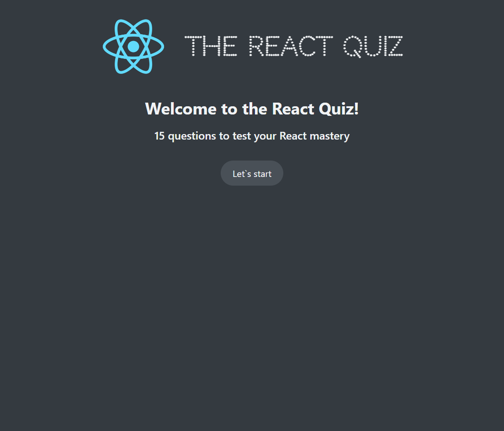
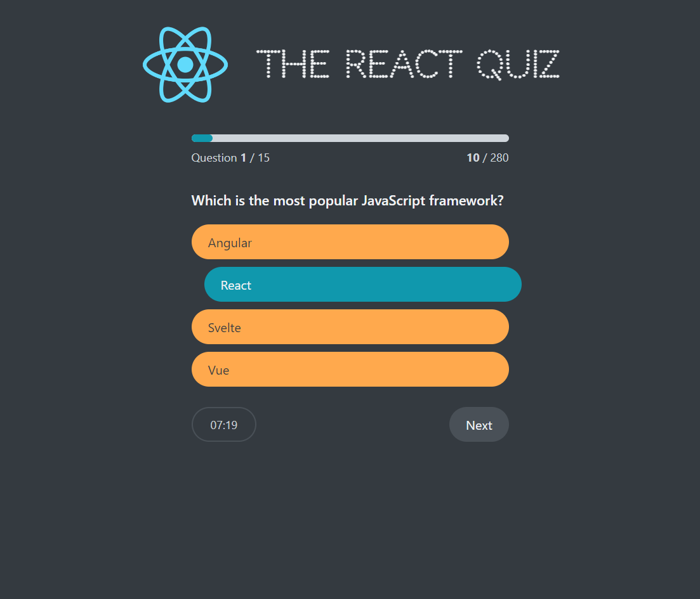

# React-Quiz

- Live Site URL: [https://kabrax01.github.io/React_Quiz/](https://kabrax01.github.io/React_Quiz/)

## Screenshots

## General information

Quiz app with time restrictions, score counter, and minimalistic interface for testing knowledge about React framework. It uses firebase to store questions, enabling future expanding for multi topics selection

## Built with

- Semantic HTML5 markup
- CSS
- JavaScript
- React
- Context API (REDUX pattern)
- Firebase

## Author

- Github - [Kabrax01](https://github.com/Kabrax01)
